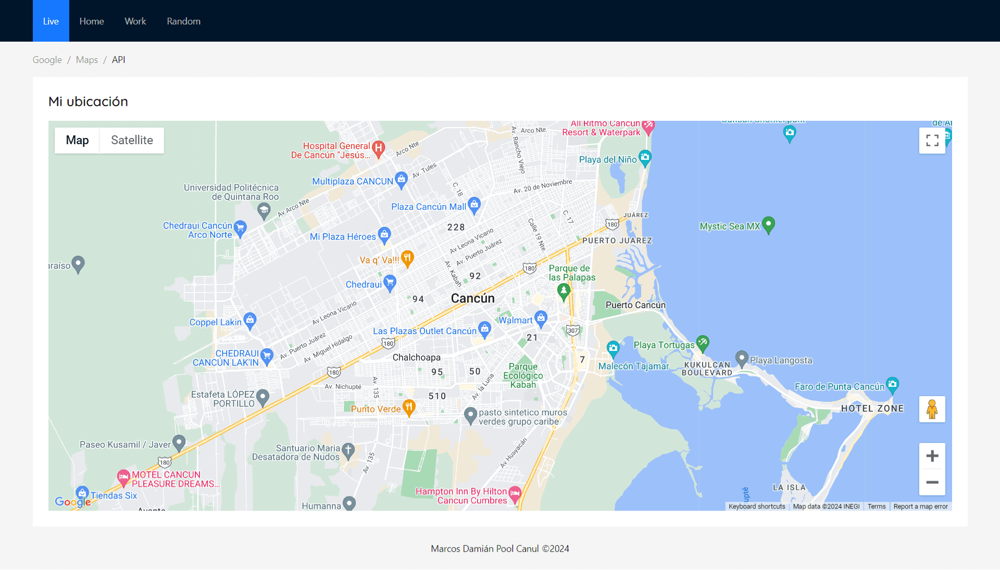

# Location Tracker App

## Descripción

Esta aplicación web interactiva permite a los usuarios visualizar y manipular un mapa utilizando la API de Google Maps. Diseñada con React y Ant Design, la interfaz es intuitiva y amigable, ofreciendo a los usuarios una experiencia de usuario fluida y atractiva.

## Funcionalidades

- **Visualización del mapa**: Muestra un mapa interactivo en el que los usuarios pueden navegar.
- **Ubicación actual**: Los usuarios pueden ver su ubicación actual en el mapa.
- **Ubicaciones predefinidas**: Permite a los usuarios seleccionar ubicaciones predefinidas como "Home" y "Work" para centrar el mapa en estas áreas.
- **Ubicación aleatoria**: Genera una ubicación aleatoria en el mundo para explorar lugares nuevos e inesperados.

## Capturas de Pantalla



## Comenzando

### Instalación

Para poner en marcha el proyecto en tu máquina local para fines de desarrollo y pruebas, sigue estos pasos:

1. Clona el repositorio:

```
git clone https://github.com/marcosd59/location-tracker-app.git
```

2. Navega al directorio del proyecto:

```
cd location-tracker-app
```

3. Instala las dependencias:

```
npm install
```

4. Inicia el servidor de desarrollo:

```
npm start
```

5. Abre `http://localhost:3000` en tu navegador para ver la aplicación en acción.

## Herramientas Utilizadas

- [React](https://reactjs.org/) - Una biblioteca de JavaScript para construir interfaces de usuario.
- [Ant Design](https://ant.design/) - Un sistema de diseño y una biblioteca de componentes de UI para React.
- [Google Maps API](https://developers.google.com/maps) - Permite personalizar mapas con contenido y estilos propios, aprovechando la robusta infraestructura de datos geográficos de Google.

## Contacto

- **Nombre**: Marcos Damián Pool Canul
- **Correo Electrónico**: damian.marcospool@gmail.com
- **GitHub**: [marcosd59](https://github.com/marcosd59)
